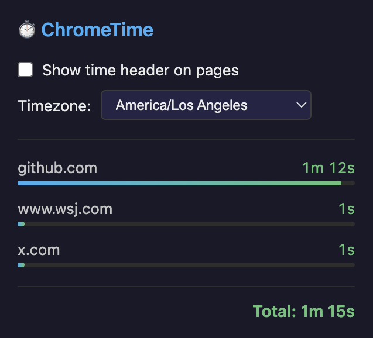

# ChromeTime

A Chrome extension that tracks how much time you spend on each website throughout the day.



## Features

- **Daily time tracking** — Automatically tracks time spent on each domain, resetting at midnight
- **On-page header** — Optional thin header overlay showing time spent on the current site
- **Timezone support** — Configure your timezone for accurate daily resets
- **Privacy-focused** — All data stays local in your browser, nothing is sent externally

## Installation

### From source

```bash
git clone https://github.com/beyang/domain-time.git
cd domain-time
npm install
npm run build
```

Then load in Chrome:
1. Go to `chrome://extensions/`
2. Enable **Developer mode** (top right)
3. Click **Load unpacked**
4. Select the `domain-time` folder

## Usage

Click the extension icon to see a breakdown of time spent on all domains today.

### Settings

- **Show time header on pages** — Displays a thin bar at the top of every page showing how long you've spent on that domain today
- **Timezone** — Controls when the daily reset happens (defaults to your system timezone)

## Development

```bash
npm run watch   # Rebuild on file changes
```

After making changes, click the refresh icon on the extension in `chrome://extensions/` and reload any open tabs.

## How it works

The extension uses a background service worker to track the active tab. Time is accumulated per-domain while a tab is focused and the browser window is active. Data is stored in `chrome.storage.local` and resets daily based on your configured timezone.

The on-page header uses Shadow DOM for style isolation, ensuring compatibility with most websites.

## License

MIT
